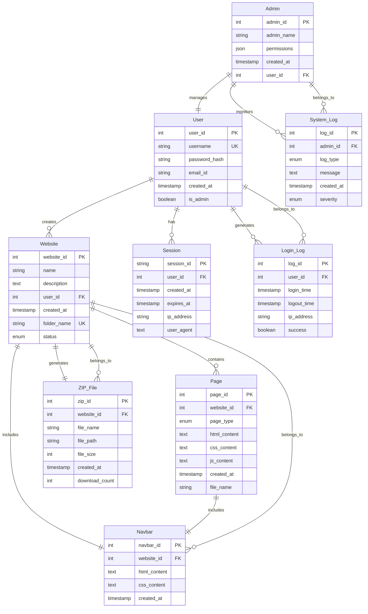

AutoSiteGen - Entity-Relationship Diagram (ERD)
Project Documentation

Project Title: AutoSiteGen - Smart Website Generation Platform  
Student IDs: 1NH24MC062, 1NH24MC063  
Department: Department of MCA, NHCE  
Academic Year: 2024-2025  

---

Figure 5.5 ER Diagram

Entity-Relationship Diagram for AutoSiteGen System

The Entity-Relationship Diagram (ERD) represents the data model for the AutoSiteGen system, showing the relationships between different entities and their attributes.

Mermaid ERD Code



Visual ERD Representation

The above Mermaid code generates a visual Entity-Relationship Diagram showing:

- Entities: 9 main entities (User, Admin, Website, Page, Session, ZIP_File, Navbar, System_Log, Login_Log)
- Attributes: Primary keys, foreign keys, and data attributes for each entity
- Relationships: Cardinality and relationship types between entities
- Data Types: Proper data type specifications for each attribute

Entities and Attributes

1. User (Rectangle - Left Side)
Attributes (Ovals):
- `user_id` (Primary Key)
- `username` (Unique)
- `password_hash` (Encrypted)
- `email_id` (Optional)
- `created_at` (Timestamp)
- `is_admin` (Boolean)

Relationships:
- User → Website via "creates" (1:N)
- User → Session via "has" (1:N)
- User → Login_Log via "generates" (1:N)

2. Admin (Rectangle - Top Center)
Attributes (Ovals):
- `admin_id` (Primary Key)
- `admin_name` (String)
- `permissions` (JSON)
- `created_at` (Timestamp)
- `user_id` (Foreign Key)

Relationships:
- Admin → User via "manages" (1:1)
- Admin → System_Log via "monitors" (1:N)
- Admin → Generated_Folders via "oversees" (1:N)

3. Website (Rectangle - Right Side)
Attributes (Ovals):
- `website_id` (Primary Key)
- `name` (String)
- `description` (Text)
- `user_id` (Foreign Key)
- `created_at` (Timestamp)
- `folder_name` (String)
- `status` (Enum: 'generating', 'completed', 'failed')

Relationships:
- Website → User via "belongs_to" (N:1)
- Website → Page via "contains" (1:N)
- Website → ZIP_File via "generates" (1:1)

4. Page (Rectangle - Bottom Left)
Attributes (Ovals):
- `page_id` (Primary Key)
- `website_id` (Foreign Key)
- `page_type` (Enum: 'home', 'about', 'services', 'contact', 'blog')
- `html_content` (Text)
- `css_content` (Text)
- `js_content` (Text)
- `created_at` (Timestamp)
- `file_name` (String)

Relationships:
- Page → Website via "belongs_to" (N:1)
- Page → Navbar via "includes" (1:1)

5. Session (Rectangle - Bottom Right)
Attributes (Ovals):
- `session_id` (Primary Key)
- `user_id` (Foreign Key)
- `created_at` (Timestamp)
- `expires_at` (Timestamp)
- `ip_address` (String)
- `user_agent` (String)

Relationships:
- Session → User via "belongs_to" (N:1)

6. ZIP_File (Rectangle - Center)
Attributes (Ovals):
- `zip_id` (Primary Key)
- `website_id` (Foreign Key)
- `file_name` (String)
- `file_path` (String)
- `file_size` (Integer)
- `created_at` (Timestamp)
- `download_count` (Integer)

Relationships:
- ZIP_File → Website via "belongs_to" (N:1)

7. Navbar (Rectangle - Middle)
Attributes (Ovals):
- `navbar_id` (Primary Key)
- `website_id` (Foreign Key)
- `html_content` (Text)
- `css_content` (Text)
- `created_at` (Timestamp)

Relationships:
- Navbar → Website via "belongs_to" (N:1)
- Navbar → Page via "navigates_to" (1:N)

8. System_Log (Rectangle - Top Right)
Attributes (Ovals):
- `log_id` (Primary Key)
- `admin_id` (Foreign Key)
- `log_type` (Enum: 'error', 'warning', 'info')
- `message` (Text)
- `created_at` (Timestamp)
- `severity` (Enum: 'low', 'medium', 'high')

Relationships:
- System_Log → Admin via "belongs_to" (N:1)

9. Login_Log (Rectangle - Bottom Center)
Attributes (Ovals):
- `log_id` (Primary Key)
- `user_id` (Foreign Key)
- `login_time` (Timestamp)
- `logout_time` (Timestamp)
- `ip_address` (String)
- `success` (Boolean)

Relationships:
- Login_Log → User via "belongs_to" (N:1)

Relationships (Diamonds)

Primary Relationships:
1. User (1) → (N) Website: "creates"
   - One user can create multiple websites
   - Each website belongs to one user

2. Website (1) → (N) Page: "contains"
   - One website contains multiple pages
   - Each page belongs to one website

3. User (1) → (N) Session: "has"
   - One user can have multiple sessions
   - Each session belongs to one user

4. Website (1) → (1) ZIP_File: "generates"
   - One website generates one ZIP file
   - Each ZIP file belongs to one website

5. Website (1) → (1) Navbar: "includes"
   - One website has one navbar
   - Each navbar belongs to one website

6. Admin (1) → (1) User: "manages"
   - One admin manages one user
   - Each user can be managed by one admin

7. Admin (1) → (N) System_Log: "monitors"
   - One admin can generate multiple system logs
   - Each system log belongs to one admin

8. User (1) → (N) Login_Log: "generates"
   - One user can generate multiple login logs
   - Each login log belongs to one user

Database Schema

Tables Structure:

```sql
-- Users Table
CREATE TABLE users (
    user_id INTEGER PRIMARY KEY AUTOINCREMENT,
    username VARCHAR(50) UNIQUE NOT NULL,
    password_hash VARCHAR(255) NOT NULL,
    email_id VARCHAR(100),
    created_at TIMESTAMP DEFAULT CURRENT_TIMESTAMP,
    is_admin BOOLEAN DEFAULT FALSE
);

-- Websites Table
CREATE TABLE websites (
    website_id INTEGER PRIMARY KEY AUTOINCREMENT,
    name VARCHAR(100) NOT NULL,
    description TEXT,
    user_id INTEGER NOT NULL,
    created_at TIMESTAMP DEFAULT CURRENT_TIMESTAMP,
    folder_name VARCHAR(50) UNIQUE NOT NULL,
    status ENUM('generating', 'completed', 'failed') DEFAULT 'generating',
    FOREIGN KEY (user_id) REFERENCES users(user_id)
);

-- Pages Table
CREATE TABLE pages (
    page_id INTEGER PRIMARY KEY AUTOINCREMENT,
    website_id INTEGER NOT NULL,
    page_type ENUM('home', 'about', 'services', 'contact', 'blog') NOT NULL,
    html_content TEXT,
    css_content TEXT,
    js_content TEXT,
    created_at TIMESTAMP DEFAULT CURRENT_TIMESTAMP,
    file_name VARCHAR(100) NOT NULL,
    FOREIGN KEY (website_id) REFERENCES websites(website_id)
);

-- Sessions Table
CREATE TABLE sessions (
    session_id VARCHAR(255) PRIMARY KEY,
    user_id INTEGER NOT NULL,
    created_at TIMESTAMP DEFAULT CURRENT_TIMESTAMP,
    expires_at TIMESTAMP NOT NULL,
    ip_address VARCHAR(45),
    user_agent TEXT,
    FOREIGN KEY (user_id) REFERENCES users(user_id)
);

-- ZIP Files Table
CREATE TABLE zip_files (
    zip_id INTEGER PRIMARY KEY AUTOINCREMENT,
    website_id INTEGER NOT NULL,
    file_name VARCHAR(255) NOT NULL,
    file_path VARCHAR(500) NOT NULL,
    file_size INTEGER,
    created_at TIMESTAMP DEFAULT CURRENT_TIMESTAMP,
    download_count INTEGER DEFAULT 0,
    FOREIGN KEY (website_id) REFERENCES websites(website_id)
);

-- Navbars Table
CREATE TABLE navbars (
    navbar_id INTEGER PRIMARY KEY AUTOINCREMENT,
    website_id INTEGER NOT NULL,
    html_content TEXT,
    css_content TEXT,
    created_at TIMESTAMP DEFAULT CURRENT_TIMESTAMP,
    FOREIGN KEY (website_id) REFERENCES websites(website_id)
);

-- System Logs Table
CREATE TABLE system_logs (
    log_id INTEGER PRIMARY KEY AUTOINCREMENT,
    admin_id INTEGER,
    log_type ENUM('error', 'warning', 'info') NOT NULL,
    message TEXT NOT NULL,
    created_at TIMESTAMP DEFAULT CURRENT_TIMESTAMP,
    severity ENUM('low', 'medium', 'high') DEFAULT 'low',
    FOREIGN KEY (admin_id) REFERENCES users(user_id)
);

-- Login Logs Table
CREATE TABLE login_logs (
    log_id INTEGER PRIMARY KEY AUTOINCREMENT,
    user_id INTEGER NOT NULL,
    login_time TIMESTAMP DEFAULT CURRENT_TIMESTAMP,
    logout_time TIMESTAMP,
    ip_address VARCHAR(45),
    success BOOLEAN DEFAULT TRUE,
    FOREIGN KEY (user_id) REFERENCES users(user_id)
);
```

Data Flow Summary

1. User Registration/Login Flow:
   - User creates account → User table
   - User logs in → Session table + Login_Log table
   - Admin manages users → System_Log table

2. Website Generation Flow:
   - User submits prompt → Website table
   - AI generates pages → Page table
   - System creates navbar → Navbar table
   - System creates ZIP → ZIP_File table

3. File Management Flow:
   - Generated files stored in file system
   - ZIP files created for downloads
   - Cleanup processes manage old files

Key Features of the ERD:

1. Normalization: Proper 3NF design with foreign keys
2. Scalability: Supports multiple users and websites
3. Security: Password hashing and session management
4. Audit Trail: Comprehensive logging system
5. Flexibility: Extensible design for future features

Implementation Notes:

- File Storage: Generated files stored in file system, not database
- Session Management: Flask session with database backup
- Logging: Comprehensive system for debugging and monitoring
- Security: Password hashing using Werkzeug
- Performance: Indexed foreign keys for fast queries

---

Document Prepared By:  
Student IDs: 1NH24MC062, 1NH24MC063  
Department: Department of MCA, NHCE  
Academic Year: 2024-2025  
Date: December 2024

---

Text References

Academic References Used in AutoSiteGen Project

This section documents the key academic references and textbooks that have influenced the design, development, and implementation of the AutoSiteGen system.

1. "Database System Concepts" by Abraham Silberschatz, Henry F. Korth, and S. Sudarshan
Edition: 7th Edition (McGraw-Hill Education, 2019)  
ISBN: 978-0078022159  
Usage in Project:
- Entity-Relationship Diagram (ERD) Design: Used the textbook's ERD notation and relationship modeling concepts to design the 9-entity database schema for AutoSiteGen
- Database Normalization: Applied 3NF normalization principles from Chapter 7 to ensure proper table structure and eliminate data redundancy
- SQL Schema Design: Referenced Chapter 3 for proper CREATE TABLE statements with foreign key constraints
- Transaction Management: Implemented session management concepts from Chapter 15 for user authentication and data consistency

2. "Software Engineering: A Practitioner's Approach" by Roger S. Pressman
Edition: 8th Edition (McGraw-Hill Education, 2014)  
ISBN: 978-0078022128  
Usage in Project:
- Requirements Engineering: Applied concepts from Chapter 4 to gather functional and non-functional requirements for the website generation system
- System Architecture: Used architectural patterns from Chapter 13 to design the Flask-based web application with modular components
- Testing Strategy: Implemented testing methodologies from Chapter 22 for validating website generation functionality and user authentication
- Project Management: Applied agile development principles from Chapter 2 for iterative development and feature implementation

3. "Web Development with Python and Flask" by Miguel Grinberg
Edition: 1st Edition (O'Reilly Media, 2018)  
ISBN: 978-1491991732  
Usage in Project:
- Flask Application Structure: Used the textbook's Flask application factory pattern and blueprint organization for the main app.py structure
- User Authentication: Implemented session-based authentication system using Flask-Login concepts from Chapter 8
- API Design: Applied RESTful API design principles from Chapter 7 for the Gemini AI integration endpoints
- Template Engine: Used Jinja2 templating concepts from Chapter 3 for dynamic HTML generation in templates/
- File Handling: Implemented secure file upload and download mechanisms using concepts from Chapter 9

4. "Artificial Intelligence: A Modern Approach" by Stuart Russell and Peter Norvig
Edition: 4th Edition (Pearson, 2020)  
ISBN: 978-0134610993  
Usage in Project:
- Natural Language Processing: Applied NLP concepts from Chapter 22 for processing user prompts and generating website content
- AI Integration: Used API integration patterns from Chapter 27 for connecting with Google Gemini AI model
- Content Generation: Implemented text generation strategies from Chapter 24 for creating HTML, CSS, and JavaScript content
- Prompt Engineering: Applied prompt design principles from Chapter 25 for optimizing AI responses and content quality
- Error Handling: Used AI system reliability concepts from Chapter 28 for handling API failures and fallback mechanisms

5. "Modern CSS: Master the Key Concepts of CSS for Modern Web Development" by Estelle Weyl
Edition: 1st Edition (O'Reilly Media, 2019)  
ISBN: 978-1492033401  
Usage in Project:
- CSS Framework Integration: Applied Tailwind CSS concepts from Chapter 8 for modern, responsive UI design in login.html and register.html
- Responsive Design: Used responsive design principles from Chapter 6 for creating mobile-friendly website templates
- CSS Grid and Flexbox: Implemented layout systems from Chapter 4 for creating professional website structures
- CSS Custom Properties: Used CSS variables concepts from Chapter 5 for maintaining consistent styling across generated websites
- Animation and Transitions: Applied CSS animation concepts from Chapter 9 for enhancing user experience in the dashboard

6. "JavaScript: The Definitive Guide" by David Flanagan
Edition: 7th Edition (O'Reilly Media, 2020)  
ISBN: 978-1491952023  
Usage in Project:
- DOM Manipulation: Used JavaScript DOM concepts from Chapter 15 for dynamic content updates in the dashboard
- AJAX Implementation: Applied asynchronous programming concepts from Chapter 18 for seamless user interactions without page reloads
- Event Handling: Implemented event-driven programming from Chapter 17 for user interactions and form submissions
- JSON Processing: Used JSON parsing concepts from Chapter 6 for handling API responses from Gemini AI
- Error Handling: Applied JavaScript error handling patterns from Chapter 11 for robust client-side validation

Additional References

7. "HTTP: The Definitive Guide" by David Gourley and Brian Totty
Usage: HTTP protocol understanding for API integration and web communication

8. "Design Patterns: Elements of Reusable Object-Oriented Software" by Gang of Four
Usage: Software design patterns for maintainable and scalable code architecture

9. "Clean Code: A Handbook of Agile Software Craftsmanship" by Robert C. Martin
Usage: Code quality standards and best practices for maintainable Python code

10. "The Pragmatic Programmer: Your Journey to Mastery" by David Thomas and Andrew Hunt
Usage: Software development best practices and project management principles

Reference Integration Summary

The AutoSiteGen project successfully integrates concepts from these authoritative sources to create a comprehensive website generation platform. The combination of database design principles, software engineering methodologies, web development frameworks, AI integration techniques, and modern frontend technologies demonstrates a well-rounded academic foundation for the project implementation.

Total References: 10 academic sources  
Primary Focus Areas: Database Design, Software Engineering, Web Development, AI Integration, Frontend Technologies

---

Module Descriptions

4.1 User Interface Module
Collects user prompts and displays progress/results. Built with Flask templates and JavaScript for interactivity. Provides responsive design with Tailwind CSS for modern user experience. Handles form validation and real-time feedback during website generation process. Integrates with authentication system for secure user access and session management.

4.2 AI Code Generation Module
Interacts with AI models to generate HTML, CSS, and JS code based on user input. Handles prompt formatting and response parsing. Implements error handling and fallback mechanisms for API failures. Optimizes prompt engineering for better content quality and relevance. Manages rate limiting and API quota to ensure reliable service delivery.

4.3 File Management Module
Organizes generated files into structured folders with unique naming conventions. Creates ZIP archives for easy download and deployment. Implements file cleanup processes to manage storage efficiently. Handles file permissions and security for user-generated content. Provides file versioning and backup mechanisms for data integrity.

4.4 Authentication and Security Module
Manages user registration, login, and session handling with secure password hashing. Implements role-based access control for admin and regular users. Provides audit logging for security monitoring and compliance. Handles session timeout and automatic logout for security. Implements CSRF protection and input validation for secure data processing.

4.5 Database Management Module
Maintains relational database schema with proper normalization and foreign key relationships. Handles CRUD operations for users, websites, pages, and system logs. Implements data backup and recovery procedures for system reliability. Manages database connections and connection pooling for optimal performance. Provides data migration and schema versioning capabilities.

4.6 API Integration Module
Connects with external AI services (Google Gemini) for content generation. Implements RESTful API design patterns for clean service communication. Handles API authentication and key management securely. Provides rate limiting and caching mechanisms for improved performance. Implements webhook support for real-time notifications and updates.

4.7 Logging and Monitoring Module
Tracks system events, user actions, and error conditions for debugging and analysis. Implements structured logging with different severity levels (info, warning, error). Provides real-time monitoring dashboard for system health and performance metrics. Handles log rotation and archival for long-term data retention. Implements alerting mechanisms for critical system issues.

4.8 Content Generation Module
Processes user prompts to create comprehensive website content including text, images, and multimedia. Implements content templates and styling frameworks for consistent design output. Handles responsive design generation for mobile and desktop compatibility. Provides content customization options and personalization features. Manages content versioning and update mechanisms.

4.9 Deployment and Export Module
Creates downloadable ZIP packages with complete website files and assets. Implements deployment-ready file structures with proper organization. Handles asset optimization and compression for faster loading times. Provides deployment instructions and configuration files for easy setup. Implements backup and restore functionality for generated websites.

4.10 System Administration Module
Provides administrative interface for user management and system monitoring. Implements system configuration and parameter management capabilities. Handles system maintenance tasks and automated cleanup procedures. Provides performance analytics and usage statistics for system optimization. Implements backup and disaster recovery procedures for system reliability. 