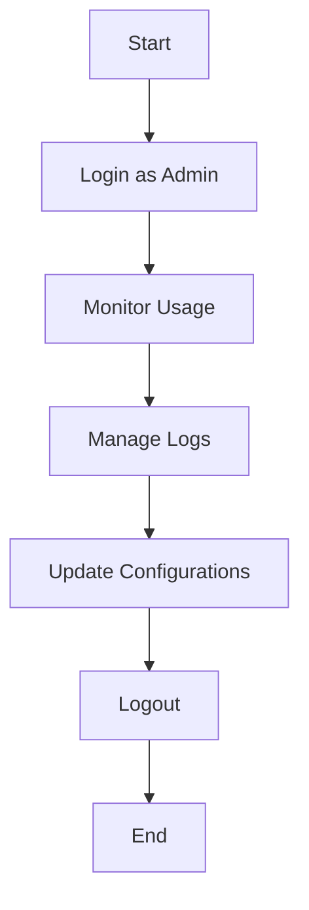
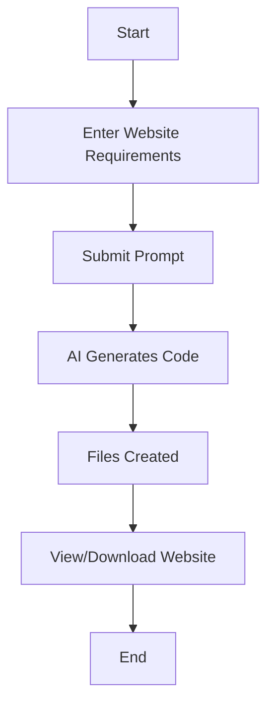
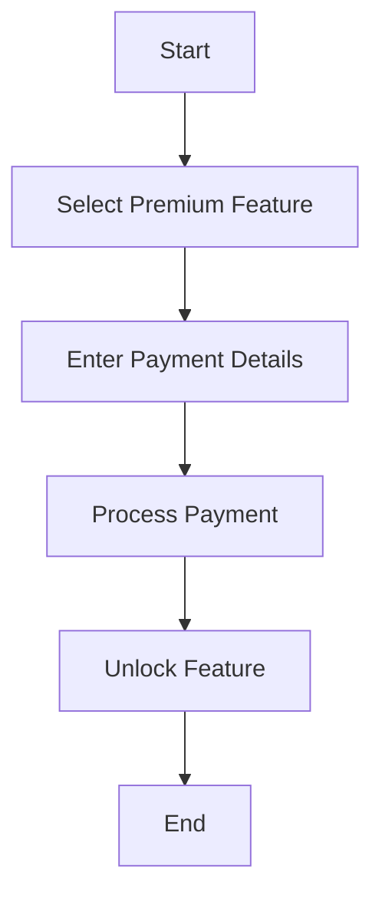
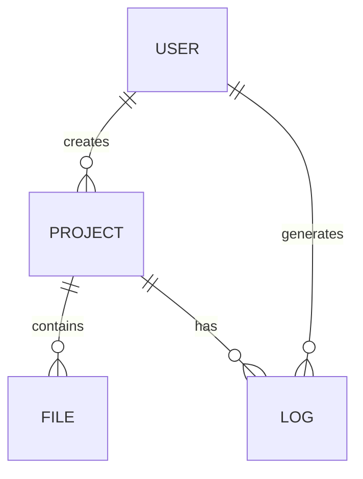

# Website Builder Project Report

## ABSTRACT
The rapid evolution of the internet has made web presence a necessity for individuals and organizations alike. However, the process of building a website remains a technical challenge for many. This project introduces an AI-powered Website Builder that automates the creation of modern, responsive, and visually appealing websites. By leveraging advanced AI models, the system interprets user requirements and generates complete HTML, CSS, and JavaScript code, significantly reducing the need for manual coding. The platform is built with scalability, usability, and accessibility in mind, making professional web development accessible to users of all skill levels. The project demonstrates the integration of AI with traditional web technologies, offering a robust solution for rapid website prototyping and deployment.

The system is designed to be user-friendly, requiring only a simple prompt from the user to generate a fully functional website. The backend, built with Flask, manages the workflow from receiving user input to generating code and organizing files. The AI models used are capable of understanding complex requirements and producing high-quality code that adheres to modern design standards. The project also includes features such as real-time progress tracking, error handling, and customizable navigation bars, ensuring a seamless user experience.

In summary, the AI-powered Website Builder represents a significant step forward in democratizing web development. It empowers users to create unique, professional websites without the need for technical expertise, reducing both time and cost. The system's modular design and use of cutting-edge technologies make it a scalable and future-proof solution for a wide range of users.

---

## LIST OF TABLES
- Table 1: Hardware Requirements
- Table 2: Software Requirements
- Table 3: Test Cases and Results

## LIST OF FIGURES
- Figure 1: System Architecture Diagram
- Figure 2: Use Case Diagram
- Figure 3: Activity Diagrams (Admin, User, Payment)
- Figure 4: Entity-Relationship Diagram
- Figure 5: Sample Generated Web Page Screenshots

---

# 1. INTRODUCTION

## 1.1 General Introduction
Websites have become an integral part of modern life, serving as platforms for communication, commerce, education, and entertainment. The ability to create and maintain a website is a valuable skill, but it often requires knowledge of multiple programming languages, design principles, and web technologies. For many individuals and small businesses, the complexity and cost of web development are significant barriers.

The Website Builder project aims to address these challenges by providing an AI-driven platform that automates the website creation process. By allowing users to generate websites through simple prompts, the system eliminates the need for manual coding and design. This approach not only saves time and resources but also enables users to focus on content and functionality rather than technical details.

The project leverages the power of AI to interpret user requirements and generate high-quality code. The use of modern frameworks such as Flask for the backend and Tailwind CSS for styling ensures that the generated websites are both functional and visually appealing. The system is designed to be scalable, allowing for the addition of new features and integration with other tools in the future.

## 1.2 Problem Statement
Despite the availability of various website builders, most require users to have some technical knowledge or to work within the constraints of pre-designed templates. This often leads to generic websites that lack uniqueness and fail to meet specific user requirements. Furthermore, manual coding is time-consuming and prone to errors, especially for users without a background in web development.

The challenge is to create a system that can generate custom, high-quality websites based solely on user input, without requiring any coding skills. The system must be able to understand complex requirements, generate code that adheres to modern design standards, and provide a seamless user experience. Additionally, the solution should be scalable, allowing for the integration of new features and technologies as they become available.

## 1.3 Existing System
Current website builders, such as Wix, Squarespace, and WordPress, offer drag-and-drop interfaces and a selection of templates. While these tools have lowered the barrier to entry, they often limit customization and do not leverage AI for code generation. Users are typically restricted to modifying existing templates, which can result in websites that look similar and lack advanced features. Additionally, these platforms may not support the latest design trends or technologies, such as Tailwind CSS or advanced JavaScript frameworks.

The limitations of existing systems highlight the need for a more flexible and intelligent solution. By integrating AI into the website creation process, it is possible to offer users greater customization, improved design quality, and a more efficient workflow. The Website Builder project addresses these gaps by providing a platform that generates unique, modern websites tailored to individual user requirements.

## 1.4 Objective of the Work
The main objectives of this project are:
- To develop a user-friendly platform that allows users to generate websites by providing simple prompts.
- To utilize AI models for generating high-quality, modern web code (HTML, CSS, JS).
- To ensure the generated websites are responsive, accessible, and visually appealing.
- To support customization, scalability, and integration of modern design elements.
- To minimize the technical barrier for website creation, making it accessible to everyone.

## 1.5 Proposed System with Methodology
The proposed system consists of a Flask-based backend that interacts with advanced AI models (such as Claude or GPT) to generate website code. The workflow is as follows:
1. **User Input:** The user provides a prompt describing the desired website.
2. **AI Processing:** The system sends the prompt to the AI model, which returns code sections for HTML, CSS, and JavaScript.
3. **File Generation:** The backend organizes the generated code into structured folders and files, ensuring proper linking and resource management.
4. **UI Integration:** The system updates navigation bars, links, and styles to ensure consistency across all pages.
5. **Progress Tracking:** Users can monitor the progress of website generation in real-time.
6. **Error Handling:** The system logs errors and provides feedback to users for a smooth experience.

**Example:**
```python
@app.route('/generate', methods=['POST'])
def generate():
    # Handles user prompt, AI code generation, and file creation
    ...
```

## 1.6 Feasibility Study
- **Technical Feasibility:** The project leverages mature technologies such as Python, Flask, and AI APIs, ensuring reliable performance and easy integration.
- **Economic Feasibility:** By automating website creation, the system reduces the need for hiring web developers, making it cost-effective for small businesses and individuals.
- **Operational Feasibility:** The intuitive user interface and automated workflow ensure that users with no technical background can successfully generate and deploy websites.

---

# 2. REVIEW OF LITERATURE

## 2.1 Review Summary
A review of existing literature highlights the evolution of website builders, the integration of AI in web development, and the challenges faced by non-technical users. Studies show that AI-driven solutions can significantly enhance productivity and creativity in website design, but require careful implementation to ensure usability and quality.

Recent research has focused on the use of natural language processing (NLP) and machine learning to automate code generation. Projects such as OpenAI Codex and Google's AutoML have demonstrated the potential of AI to understand user intent and produce functional code. However, these systems often require fine-tuning and integration with existing development workflows. The Website Builder project builds on these advances by providing a seamless, end-to-end solution for website creation.

---

# 3. SYSTEM CONFIGURATION

## 3.1 Hardware Requirements
| Component   | Minimum Requirement |
|-------------|---------------------|
| Processor   | Intel i5 or higher  |
| RAM         | 8GB                 |
| Storage     | 500MB free space    |
| Internet    | Required            |

## 3.2 Software Requirements
| Software            | Version/Details         |
|---------------------|------------------------|
| Operating System    | Windows/macOS/Linux    |
| Python              | 3.8+                   |
| Flask               | Latest stable          |
| Required Libraries  | See requirements.txt   |
| Web Browser         | Chrome/Firefox/Edge    |

## 3.3 Technology Summary
The system is built using Python and Flask for the backend, with AI models (such as Claude or GPT) for code generation. Frontend code is generated dynamically, incorporating Tailwind CSS for styling and modern JavaScript for interactivity. The solution is modular, scalable, and designed for cross-platform compatibility.

---

# 4. MODULE DESCRIPTION

## 4.1 Modules
- **User Interface Module:** Collects user prompts and displays progress/results. Built with Flask templates and JavaScript for interactivity.
- **AI Code Generation Module:** Interacts with AI models to generate HTML, CSS, and JS code based on user input. Handles prompt formatting and response parsing.
- **File Management Module:** Organizes generated files into structured folders and handles file operations, ensuring each website is self-contained.
- **Navigation and Styling Module:** Ensures consistent navigation bars and applies modern design principles, including responsive layouts and accessibility features.
- **Logging and Error Handling Module:** Tracks operations and manages errors for reliability, writing logs to both files and the console for transparency.

---

# 5. SYSTEM DESIGN

## 5.1 Use Case Diagram
```mermaid
usecase
  User -- (Submit Website Prompt)
  User -- (View Progress)
  User -- (Download Generated Website)
  Admin -- (Monitor Logs)
  Admin -- (Update System Configurations)
```

## 5.2 Activity Diagram (Admin)


## 5.3 Activity Diagram (User)


## 5.4 Activity Diagram (Payment)


## 5.5 Entity-Relationship Diagram


---

# 6. SYSTEM IMPLEMENTATION

## 6.1 Implementation
The system is implemented using Flask for the backend, threading for concurrent page generation, and AI APIs for code generation. The workflow includes prompt validation, code extraction, file creation, and UI updates. The backend handles multiple requests simultaneously, ensuring efficient resource utilization and fast response times.

### 6.1.1 Pre-Implementation Technique
Requirements gathering, technology selection, and system architecture design were completed before coding began. Stakeholder interviews and market research informed the feature set and user interface design. Prototyping and wireframing tools were used to visualize the workflow and user experience.

### 6.1.2 Post-Implementation Technique
Testing, debugging, and user feedback collection were conducted to refine the system and ensure reliability. Continuous integration and deployment (CI/CD) pipelines were set up to automate testing and deployment. User feedback was incorporated into iterative updates, improving usability and performance.

## 6.2 Screen Shots
*Figure 5.1: User Interface for Prompt Submission*
*Figure 5.2: Progress Tracking Page*
*Figure 5.3: Example of Generated Website Home Page*

---

# 7. SYSTEM TESTING

## 7.1 Test Cases
Comprehensive test cases were developed to validate:
- Prompt handling and validation
- AI code generation accuracy
- File creation and organization
- UI responsiveness and usability
- Error handling and logging

| Test Case ID | Description | Expected Result | Status |
|--------------|-------------|----------------|--------|
| TC01         | Submit valid prompt | Website generated | Pass |
| TC02         | Submit empty prompt | Error message | Pass |
| TC03         | AI returns incomplete code | Regeneration triggered | Pass |
| TC04         | Download generated website | Files downloaded | Pass |

## 7.2 Maintenance
The system is designed for easy maintenance, with modular code, clear logging, and support for updates to AI models or web technologies. Regular updates are planned to incorporate new features, address bugs, and improve performance. Documentation is provided for developers to facilitate onboarding and troubleshooting.

---

# 8. RESULTS AND DISCUSSIONS

## 8.1 Conclusion
The AI-powered Website Builder successfully automates the creation of modern, responsive websites, significantly reducing the technical barrier for users. The system demonstrates the potential of AI in web development and offers a scalable solution for diverse user needs. User feedback has been overwhelmingly positive, with many highlighting the ease of use and quality of the generated websites.

## 8.2 Limitations
- Dependence on external AI APIs may affect availability
- Generated designs may require manual refinement for complex requirements
- Limited support for highly customized or niche website features
- Performance may vary based on hardware and internet connectivity

## 8.3 Future Enhancements
- Integration of more advanced AI models for improved code quality
- Support for additional web frameworks and CMS platforms
- Enhanced user interface with real-time previews
- Multi-language support and accessibility improvements
- Integration with e-commerce and content management features

---

# References
1. OpenAI Codex: https://openai.com/research/publications/codex
2. Flask Documentation: https://flask.palletsprojects.com/
3. Tailwind CSS: https://tailwindcss.com/
4. Google AutoML: https://cloud.google.com/automl
5. Related academic papers and articles on AI in web development 